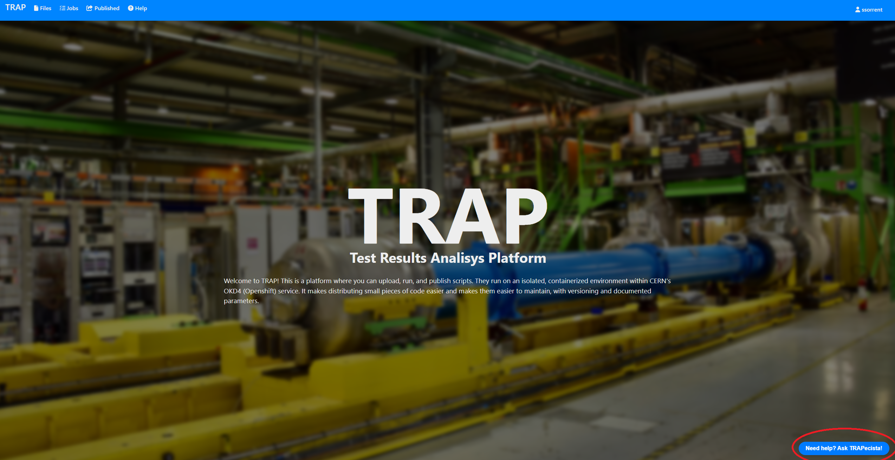
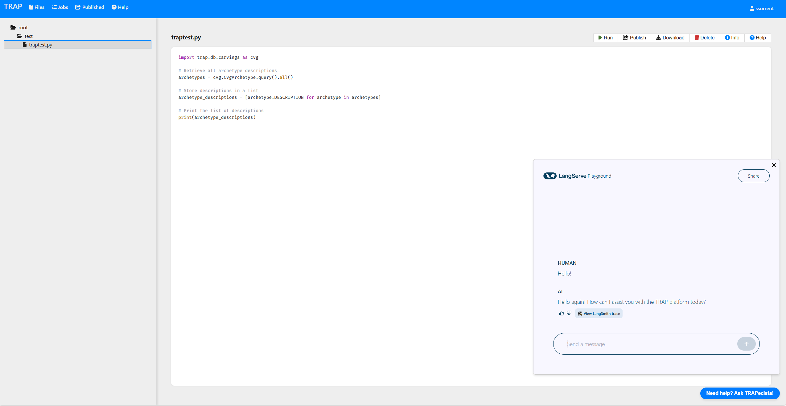
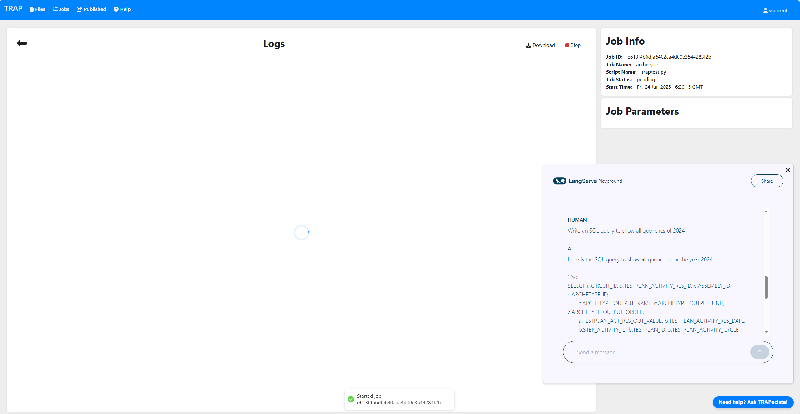

<h1>Data Science for Knowledge Management at CERN: AI and NLP solutions 
TRAPecista, an Expert Chatbot for Integrated SQL and Technical Assistance.</h1>  

                                                                           

Henri de Toulouse-Lautrec, "Le trapèze volant", 1899

<h4>Cloud deployed LLM-based application developed for information management and retrieval at CERN. It helps users querying a complex database through natural language and interacting with various web applications used in the TE (Technology) department for technical tasks.
It supports different LLMs chat models / embeddings and it is built as a multi-agent graph, using the langchain library and RAG technologies, achieving efficient text-to-SQL. (without full-disclosure of the prompts, examples, RAG documents and architecture)</h4>
<a href="https://drive.google.com/drive/folders/1rakSJeKJDmcE7m7xzYjdXcRM1hbSWzXl?usp=share_link">DEMO</a> 
 
          
     
     
