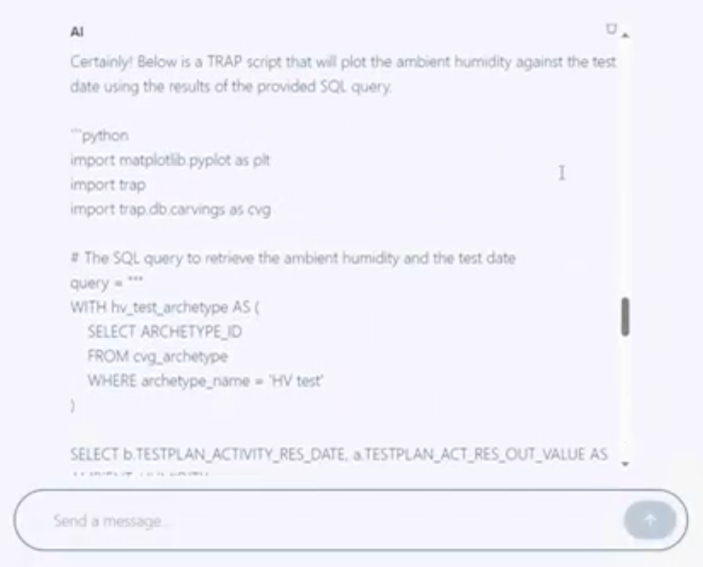
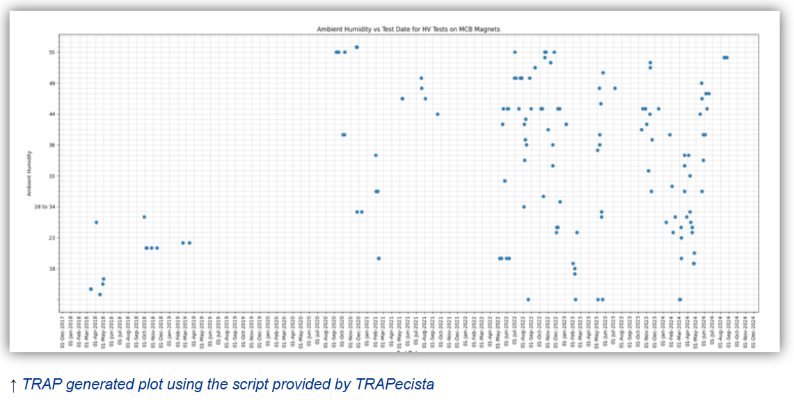
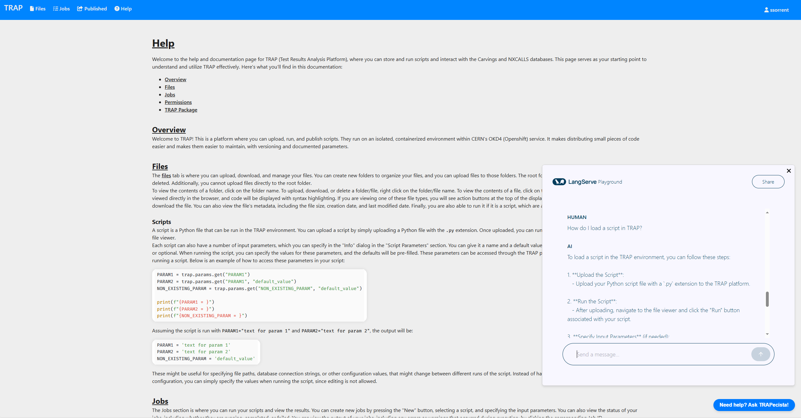

<h1>Data Science for Knowledge Management at CERN: AI and NLP solutions 
TRAPecista, an Expert Chatbot for Integrated SQL and Technical Assistance.</h1>  

                                                                           

Henri de Toulouse-Lautrec, "Le trapèze volant", 1899

<h4>Cloud deployed LLM-based application developed for information management and retrieval at CERN. It helps users querying a complex database through natural language and interacting with various web applications used in the TE (Technology) department for technical tasks, maily TRAP (Test results Analysis Platform).
It supports different LLMs chat models / embeddings and it is built as a multi-agent graph, using the langchain library and RAG technologies, achieving efficient text-to-SQL. (without full-disclosure of the prompts, examples, RAG documents and architecture)</h4>
<h4>This version is set to support OpenAI models. To change the OpenAI API key, edit the environment variable "OPEN_AI_API_KEY". To change the Large Language Model, edit the environment variable "MODEL_NAME". The default model is "gpt-4o-mini"</h4>

<a href="https://drive.google.com/drive/folders/1rakSJeKJDmcE7m7xzYjdXcRM1hbSWzXl?usp=share_link">DEMO</a> 
 
          
     
     
    
     
     

